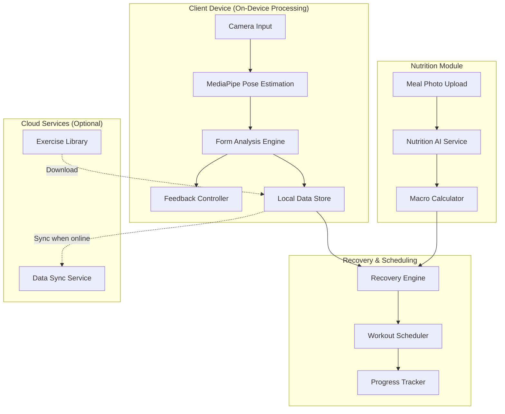

# Design Document: PhysioTrack AI

## Overview

PhysioTrack AI is a comprehensive fitness and recovery ecosystem that combines computer vision, adaptive scheduling algorithms, and AI-powered nutrition analysis to provide professional-level fitness guidance. The system architecture prioritizes privacy through on-device processing, accessibility through camera-only operation, and effectiveness through real-time feedback and scientifically-based recovery planning.

The system consists of four primary subsystems:
1. **Motion Analysis Pipeline**: Real-time body tracking and form evaluation using MediaPipe
2. **Feedback Delivery System**: Multi-modal user feedback (voice, haptic, visual)
3. **Adaptive Recovery Engine**: Intelligent workout scheduling and fatigue management
4. **Nutrition Intelligence Module**: AI-powered meal analysis and macro tracking

## Architecture

### High-Level Architecture



### Component Interaction Flow

**Workout Session Flow:**
1. User initiates workout session
2. Camera activates and MediaPipe begins landmark detection
3. Form Analyzer compares landmarks against exercise template
4. Feedback Controller provides real-time corrections
5. Valid repetitions are counted and stored locally
6. Session completion triggers Recovery Engine update

**Recovery Planning Flow:**
1. Recovery Engine analyzes completed workout data
2. Calculates muscle-specific recovery windows
3. Workout Scheduler generates next session recommendations
4. Progress Tracker updates trends and goal progress

**Nutrition Flow:**
1. User uploads meal photo
2. Nutrition AI identifies foods and estimates portions
3. Macro Calculator computes nutritional content
4. Recovery Engine adjusts protein targets based on recent workouts

## Components and Interfaces

### 1. Motion Analysis Pipeline

#### MediaPipe Integration
- **Technology**: MediaPipe Pose Landmarker
- **Input**: Video frames from device camera (RGB, 640x480 minimum)
- **Output**: 33 body landmarks with (x, y, z) coordinates and visibility scores
- **Processing**: On-device inference using TensorFlow Lite models
- **Performance Target**: 15+ FPS on mid-range mobile devices

#### Landmark Structure
```typescript
interface Landmark {
  x: number;        // Normalized x-coordinate [0, 1]
  y: number;        // Normalized y-coordinate [0, 1]
  z: number;        // Depth relative to hips
  visibility: number; // Confidence score [0, 1]
}

interface PoseFrame {
  landmarks: Landmark[33];  // 33 body points
  timestamp: number;
  frameId: number;
}
```

#### Form Analysis Engine

**Joint Angle Calculation:**
```typescript
interface JointAngle {
  joint: string;           // e.g., "left_elbow", "right_knee"
  angle: number;           // Degrees [0, 180]
  isWithinSafeRange: boolean;
  deviation: number;       // Degrees from ideal
}

function calculateJointAngle(
  point1: Landmark,
  vertex: Landmark,
  point2: Landmark
): number {
  // Calculate angle using vector dot product
  // Returns angle in degrees
}
```

**Exercise Template:**
```typescript
interface ExerciseTemplate {
  id: string;
  name: string;
  muscleGroups: string[];
  keyJoints: string[];      // Joints to monitor
  phases: ExercisePhase[];  // Movement phases
  safetyThresholds: SafetyThreshold[];
}

interface ExercisePhase {
  name: string;             // e.g., "descent", "bottom", "ascent"
  duration: [number, number]; // Min/max seconds
  jointAngles: {
    [joint: string]: {
      min: number;
      max: number;
      ideal: number;
    }
  };
}

interface SafetyThreshold {
  joint: string;
  maxDeviation: number;     // Degrees
  riskLevel: "low" | "medium" | "high";
}
```

**Form Quality Scoring:**
```typescript
interface FormScore {
  overall: number;          // 0-100
  jointScores: Map<string, number>;
  violations: FormViolation[];
  timestamp: number;
}

interface FormViolation {
  joint: string;
  severity: "low" | "medium" | "high";
  message: string;
  correctionHint: string;
}

function calculateFormScore(
  currentAngles: JointAngle[],
  template: ExerciseTemplate,
  phase: ExercisePhase
): FormScore {
  // Compare current angles to template
  // Weight by joint importance
  // Penalize safety violations more heavily
}
```

**Repetition Validation:**
```typescript
interface RepetitionState {
  count: number;
  partialReps: number;
  currentPhase: string;
  phaseStartTime: number;
  rangeOfMotionAchieved: boolean;
  formQualityMet: boolean;
}

function validateRepetition(
  frames: PoseFrame[],
  template: ExerciseTemplate
): boolean {
  // Verify all phases completed in sequence
  // Check range of motion for each phase
  // Ensure form quality >= 70% throughout
  // Return true only if all criteria met
}
```

### 2. Feedback Delivery System

#### Feedback Controller
```typescript
interface FeedbackConfig {
  voiceEnabled: boolean;
  hapticEnabled: boolean;
  visualEnabled: boolean;
  minIntervalMs: number;    // Minimum time between feedbacks
  priorityThreshold: "low" | "medium" | "high";
}

interface FeedbackEvent {
  type: "voice" | "haptic" | "visual";
  priority: "low" | "medium" | "high";
  message: string;
  timestamp: number;
}

class FeedbackController {
  private lastFeedbackTime: number = 0;
  private feedbackQueue: PriorityQueue<FeedbackEvent>;
  
  queueFeedback(event: FeedbackEvent): void {
    // Add to priority queue
    // High priority (safety) always goes first
  }
  
  deliverFeedback(): void {
    // Check if minimum interval has elapsed
    // Deliver highest priority feedback
    // Update lastFeedbackTime
  }
}
```

#### Voice Feedback
```typescript
interface VoiceCue {
  text: string;
  urgency: "normal" | "urgent";
  language: string;
}

class VoiceFeedbackService {
  speak(cue: VoiceCue): void {
    // Use device text-to-speech
    // Interrupt current speech if urgent
  }
  
  generateCorrectionCue(violation: FormViolation): VoiceCue {
    // Convert technical violation to user-friendly instruction
    // e.g., "Straighten your back" instead of "Spine angle 15° off"
  }
}
```

#### Haptic Feedback
```typescript
enum HapticPattern {
  WARNING = "warning",      // Short sharp pulse
  ERROR = "error",          // Double pulse
  SUCCESS = "success"       // Gentle pulse
}

class HapticFeedbackService {
  trigger(pattern: HapticPattern): void {
    // Use device haptic API
    // Different patterns for different feedback types
  }
}
```

### 3. Adaptive Recovery Engine

#### Recovery Window Calculator
```typescript
interface MuscleGroup {
  name: string;
  lastWorkedTimestamp: number;
  intensity: "low" | "medium" | "high";
  volume: number;           // Total reps or time
  recoveryHours: number;    // Required recovery time
}

interface RecoveryWindow {
  muscleGroup: string;
  workoutTimestamp: number;
  recoveryCompleteTimestamp: number;
  percentRecovered: number; // 0-100
}

function calculateRecoveryWindow(
  muscleGroup: string,
  intensity: string,
  volume: number
): number {
  // Base recovery times:
  // Low intensity: 24 hours
  // Medium intensity: 48 hours
  // High intensity: 72 hours
  // Adjust based on volume
}
```

#### Workout Scheduler
```typescript
interface WorkoutPlan {
  userId: string;
  weeklySchedule: ScheduledWorkout[];
  goals: FitnessGoal[];
  lastUpdated: number;
}

interface ScheduledWorkout {
  date: Date;
  exercises: Exercise[];
  targetMuscleGroups: string[];
  estimatedDuration: number;
  intensity: "low" | "medium" | "high";
}

interface FitnessGoal {
  type: "strength" | "endurance" | "weight_loss" | "muscle_gain" | "flexibility";
  target: number;
  current: number;
  deadline: Date;
  priority: number;
}

class WorkoutScheduler {
  generateWeeklyPlan(
    recoveryWindows: RecoveryWindow[],
    goals: FitnessGoal[],
    missedSessions: ScheduledWorkout[]
  ): WorkoutPlan {
    // Balance muscle groups across week
    // Respect recovery windows
    // Compensate for missed sessions
    // Progress toward goals
  }
  
  adjustForMissedSession(
    plan: WorkoutPlan,
    missedWorkout: ScheduledWorkout
  ): WorkoutPlan {
    // Redistribute volume across remaining sessions
    // Maintain weekly targets
  }
  
  detectOvertraining(
    recentWorkouts: CompletedWorkout[],
    recoveryWindows: RecoveryWindow[]
  ): boolean {
    // Check for insufficient recovery
    // Monitor performance decline
    // Flag if overtraining detected
  }
}
```

#### Fatigue Tracking
```typescript
interface FatigueIndicators {
  muscleGroup: string;
  formQualityTrend: number[];  // Recent form scores
  volumeCompletion: number;     // % of planned volume completed
  perceivedExertion: number;    // User-reported 1-10
  recoveryScore: number;        // 0-100
}

function calculateFatigueScore(indicators: FatigueIndicators): number {
  // Declining form quality = higher fatigue
  // Lower volume completion = higher fatigue
  // Higher perceived exertion = higher fatigue
  // Return composite score 0-100
}
```

### 4. Nutrition Intelligence Module

#### Meal Photo Analysis
```typescript
interface MealPhoto {
  imageData: Blob;
  timestamp: number;
  userId: string;
}

interface FoodItem {
  name: string;
  confidence: number;       // 0-1
  portionSize: number;      // grams
  portionConfidence: number;
  boundingBox: {
    x: number;
    y: number;
    width: number;
    height: number;
  };
}

interface NutritionEstimate {
  foodItems: FoodItem[];
  totalMacros: Macros;
  confidence: number;
  timestamp: number;
}

interface Macros {
  protein: number;          // grams
  carbohydrates: number;    // grams
  fat: number;              // grams
  calories: number;
}
```

#### Nutrition AI Service
```typescript
class NutritionAIService {
  async analyzeMealPhoto(photo: MealPhoto): Promise<NutritionEstimate> {
    // Send to cloud-based vision API
    // Identify food items
    // Estimate portion sizes using reference objects
    // Calculate macros from food database
    // Return estimate with confidence scores
  }
  
  async getFoodNutrition(foodName: string, portionGrams: number): Promise<Macros> {
    // Query nutrition database
    // Scale macros by portion size
  }
}
```

#### Dynamic Macro Adjustment
```typescript
interface MacroTargets {
  protein: number;
  carbohydrates: number;
  fat: number;
  calories: number;
  adjustmentReason?: string;
}

class MacroCalculator {
  calculateBaseTargets(
    userWeight: number,
    goal: FitnessGoal,
    activityLevel: string
  ): MacroTargets {
    // Standard macro calculations based on goal
  }
  
  adjustForWorkout(
    baseTargets: MacroTargets,
    workout: CompletedWorkout
  ): MacroTargets {
    // Increase protein 15-25% after high-intensity workouts
    // Scale based on volume and muscle groups trained
    // Duration: until recovery window expires
  }
  
  accommodateDietaryRestrictions(
    targets: MacroTargets,
    restrictions: string[]
  ): MacroTargets {
    // Adjust for vegetarian, vegan, allergies, etc.
    // Maintain total calories while shifting macro ratios
  }
}
```

### 5. Data Storage and Sync

#### Local Storage Schema
```typescript
interface LocalDatabase {
  workouts: CompletedWorkout[];
  exerciseTemplates: ExerciseTemplate[];
  recoveryWindows: RecoveryWindow[];
  nutritionLog: NutritionEstimate[];
  userProfile: UserProfile;
  goals: FitnessGoal[];
}

interface CompletedWorkout {
  id: string;
  timestamp: number;
  exercises: CompletedExercise[];
  duration: number;
  totalVolume: number;
  averageFormScore: number;
}

interface CompletedExercise {
  exerciseId: string;
  sets: ExerciseSet[];
  muscleGroups: string[];
  formScores: number[];
}

interface ExerciseSet {
  reps: number;
  validReps: number;
  partialReps: number;
  averageFormScore: number;
  duration: number;
}
```

#### Cloud Sync Service
```typescript
interface SyncService {
  syncWorkoutData(localData: CompletedWorkout[]): Promise<void>;
  syncNutritionData(localData: NutritionEstimate[]): Promise<void>;
  downloadExerciseLibrary(): Promise<ExerciseTemplate[]>;
  resolveConflicts(local: any, remote: any): any;
}

class CloudSyncManager {
  private syncQueue: SyncOperation[] = [];
  
  async syncWhenOnline(): Promise<void> {
    // Check connectivity
    // Upload local changes
    // Download remote updates
    // Resolve conflicts (local wins for workout data)
  }
  
  queueForSync(operation: SyncOperation): void {
    // Add to queue
    // Attempt sync if online
  }
}
```

## Data Models

### Core Entities

**User Profile:**
```typescript
interface UserProfile {
  id: string;
  age: number;
  weight: number;
  height: number;
  fitnessLevel: "beginner" | "intermediate" | "advanced";
  goals: FitnessGoal[];
  dietaryRestrictions: string[];
  preferences: UserPreferences;
}

interface UserPreferences {
  feedbackConfig: FeedbackConfig;
  workoutDays: number[];        // 0-6 (Sunday-Saturday)
  sessionDuration: number;      // Preferred minutes
  equipment: string[];          // Available equipment
}
```

**Exercise Library:**
```typescript
interface Exercise {
  id: string;
  name: string;
  description: string;
  muscleGroups: string[];
  difficulty: "beginner" | "intermediate" | "advanced";
  equipment: string[];
  videoUrl: string;
  template: ExerciseTemplate;
}
```

**Progress Metrics:**
```typescript
interface ProgressMetrics {
  userId: string;
  period: "week" | "month" | "all_time";
  workoutsCompleted: number;
  totalVolume: number;
  averageFormScore: number;
  goalProgress: Map<string, number>;  // goal_id -> percent complete
  strengthTrends: Map<string, number[]>;  // exercise_id -> max reps over time
  consistencyScore: number;     // 0-100
}
```

### State Management

**Session State:**
```typescript
interface WorkoutSession {
  id: string;
  startTime: number;
  currentExercise: Exercise;
  currentSet: number;
  repCount: number;
  partialRepCount: number;
  formScores: number[];
  isPaused: boolean;
  pauseStartTime?: number;
  totalPauseTime: number;
}
```

**Application State:**
```typescript
interface AppState {
  isOnline: boolean;
  cameraActive: boolean;
  currentSession?: WorkoutSession;
  pendingSyncOperations: number;
  lastSyncTime: number;
  recoveryStatus: Map<string, RecoveryWindow>;
}
```


## Correctness Properties

*A property is a characteristic or behavior that should hold true across all valid executions of a system—essentially, a formal statement about what the system should do. Properties serve as the bridge between human-readable specifications and machine-verifiable correctness guarantees.*

### Property Reflection

After analyzing all acceptance criteria, I identified several areas where properties can be consolidated to avoid redundancy:

**Motion Analysis Properties:**
- Properties about landmark detection, joint angle calculation, and form scoring can be combined into comprehensive validation properties
- Separate properties for different form violations can be unified into a single property about threshold detection

**Recovery Engine Properties:**
- Multiple properties about schedule adjustment (missed sessions, fatigue, early completion) can be consolidated into a single adaptive scheduling property
- Properties about recovery window calculation and checking can be combined

**Nutrition Properties:**
- Properties about macro calculation and confidence scores can be unified
- Properties about adjustments and notifications can be combined

**Data Management Properties:**
- Properties about state preservation (pause/resume) are naturally round-trip properties
- Properties about data completeness can be consolidated

### Motion Analysis Properties

**Property 1: Joint Angle Calculation Completeness**
*For any* set of detected body landmarks, the Motion_Analyzer should calculate joint angles for all key joints defined in the current exercise template.
**Validates: Requirements 1.3**

**Property 2: Missing Landmark Notification**
*For any* frame where required landmarks have visibility scores below the detection threshold, the Motion_Analyzer should generate a user notification with positioning guidance.
**Validates: Requirements 1.4**

**Property 3: Form Deviation Detection**
*For any* joint angle that deviates beyond the safe threshold defined in the exercise template, the Motion_Analyzer should flag the movement as incorrect and identify the specific joint.
**Validates: Requirements 2.2**

**Property 4: Form Analysis Completeness**
*For any* posture analysis, the evaluation should include spine alignment metrics, joint positioning metrics, and movement symmetry metrics.
**Validates: Requirements 2.3**

**Property 5: Exercise Template Availability**
*For any* exercise in the supported exercise list, a corresponding form template with joint angle thresholds and phase definitions should exist.
**Validates: Requirements 2.4**

**Property 6: Form Score Bounds**
*For any* completed form analysis, the generated form quality score should be a number between 0 and 100 inclusive.
**Validates: Requirements 2.5**

### Feedback System Properties

**Property 7: Haptic Feedback Triggering**
*For any* unsafe movement detection event, if haptic feedback is enabled in the user's configuration, a haptic alert should be triggered.
**Validates: Requirements 3.2**

**Property 8: Voice Cue Body Part Specification**
*For any* voice cue generated from a form violation, the cue text should contain the name of the body part that needs correction.
**Validates: Requirements 3.3**

**Property 9: Feedback Prioritization by Severity**
*For any* set of simultaneously detected form violations, the feedback delivered should correspond to the violation with the highest injury risk severity.
**Validates: Requirements 3.4**

### Repetition Validation Properties

**Property 10: Range of Motion Verification**
*For any* movement sequence, a repetition should only be counted as valid if all phases of the exercise template are completed with joint angles within the defined range of motion.
**Validates: Requirements 4.1**

**Property 11: Incomplete ROM Rejection**
*For any* movement sequence where the range of motion is incomplete, the repetition count should remain unchanged.
**Validates: Requirements 4.2**

**Property 12: Form Quality Threshold**
*For any* movement sequence with an average form quality score below 70%, the repetition should not be counted as valid.
**Validates: Requirements 4.3**

**Property 13: Valid Repetition Counting**
*For any* movement sequence that meets both range of motion and form quality requirements, the valid repetition count should increase by exactly 1.
**Validates: Requirements 4.4**

**Property 14: Partial Repetition Separation**
*For any* workout session, partial repetitions and valid repetitions should be tracked in separate counters, and the sum of both should equal the total movement attempts.
**Validates: Requirements 4.5**

### Recovery Engine Properties

**Property 15: Recovery Window Calculation**
*For any* completed workout, the Recovery_Engine should calculate a recovery window for each muscle group trained, with duration based on workout intensity (24h for low, 48h for medium, 72h for high) and adjusted for volume.
**Validates: Requirements 5.1**

**Property 16: Recovery Status Checking**
*For any* workout start attempt, the Recovery_Engine should verify that all target muscle groups have completed their recovery windows or generate a warning if recovery is insufficient.
**Validates: Requirements 5.2, 5.3**

**Property 17: Recovery Period Bounds**
*For any* calculated recovery window, the duration should be between 24 and 72 hours based on workout intensity and muscle group.
**Validates: Requirements 5.4**

**Property 18: Override Logging**
*For any* recovery warning override event, the system should create a log entry and mark the affected muscle groups for adjusted future recommendations.
**Validates: Requirements 5.5**

**Property 19: Adaptive Schedule Adjustment**
*For any* missed workout session, the Recovery_Engine should redistribute the planned volume across remaining sessions in the week while maintaining the weekly target volume.
**Validates: Requirements 6.1**

**Property 20: Fatigue-Based Intensity Reduction**
*For any* workout plan generation when muscle fatigue indicators exceed the high threshold, the recommended workout intensity should be lower than the previous session or rest should be suggested.
**Validates: Requirements 6.2**

**Property 21: Progressive Overload**
*For any* sequence of N consecutive workouts completed ahead of schedule (N ≥ 3), the difficulty of subsequent workouts should increase compared to the baseline.
**Validates: Requirements 6.3**

**Property 22: Muscle Group Balance**
*For any* generated weekly workout schedule, the total volume should be distributed such that no muscle group receives more than 40% of the total weekly volume.
**Validates: Requirements 6.4**

### Nutrition Analysis Properties

**Property 23: Macro Calculation from Portions**
*For any* set of identified food items with estimated portion sizes, the Nutrition_Analyzer should calculate total macros (protein, carbs, fat, calories) by summing the individual food item macros.
**Validates: Requirements 7.3**

**Property 24: Confidence Score Presence**
*For any* nutrition estimate, confidence scores should be provided for each identified food item and for the overall meal estimate.
**Validates: Requirements 7.4**

**Property 25: Unidentified Food Handling**
*For any* meal photo analysis where one or more food items cannot be identified with confidence above the threshold, the system should prompt the user for manual input for those items.
**Validates: Requirements 7.5**

**Property 26: Post-Workout Protein Adjustment**
*For any* high-intensity workout completion, the daily protein target should increase by a percentage between 15% and 25% of the baseline target.
**Validates: Requirements 8.1**

**Property 27: Protein Adjustment Factors**
*For any* protein target adjustment calculation, the adjustment percentage should be influenced by all three factors: workout volume, intensity level, and number of muscle groups trained.
**Validates: Requirements 8.2**

**Property 28: Adjustment Notification**
*For any* protein target adjustment, a notification should be generated that includes the new target value and the reason for the adjustment.
**Validates: Requirements 8.3**

**Property 29: Protein Target Reversion**
*For any* protein target adjustment, when the associated recovery window expires, the protein target should return to the user's baseline target.
**Validates: Requirements 8.4**

**Property 30: Dietary Restriction Accommodation**
*For any* nutrition recommendation, if the user has dietary restrictions, the recommended foods should not include any items that violate those restrictions.
**Validates: Requirements 8.5**

### Data Privacy and Storage Properties

**Property 31: Aggregated Data Storage**
*For any* workout session save operation, the stored data should contain only aggregated statistics (rep counts, form scores, duration) and should not contain raw video frames or complete landmark sequences.
**Validates: Requirements 9.4**

### Platform Support Properties

**Property 32: Camera Selection Availability**
*For any* device with multiple cameras, the Motion_Analyzer should provide a camera selection interface that lists all available cameras.
**Validates: Requirements 10.3**

**Property 33: Resolution Adaptation**
*For any* camera input with resolution between 480p and 4K and aspect ratio between 4:3 and 21:9, the Motion_Analyzer should successfully process frames and detect landmarks.
**Validates: Requirements 10.4**

**Property 34: Low Quality Camera Notification**
*For any* camera input where landmark detection confidence falls below the quality threshold for 5 consecutive seconds, the Motion_Analyzer should notify the user with specific improvement suggestions.
**Validates: Requirements 10.5**

### Exercise Library Properties

**Property 35: Exercise Information Completeness**
*For any* exercise displayed to the user, the information should include target muscle groups, difficulty level, equipment requirements, and a demonstration video URL.
**Validates: Requirements 11.3**

**Property 36: Exercise Search Accuracy**
*For any* exercise search query by muscle group, equipment, or difficulty, all returned results should match the search criteria.
**Validates: Requirements 11.4**

**Property 37: New Exercise Notification Relevance**
*For any* new exercise added to the library, notifications should only be sent to users whose goals or recent workout patterns align with the exercise's target muscle groups.
**Validates: Requirements 11.5**

### Session Management Properties

**Property 38: Pause-Resume State Preservation (Round Trip)**
*For any* workout session, pausing and then immediately resuming should restore the exact session state including rep counts, current exercise, current set, and elapsed time.
**Validates: Requirements 12.2, 12.3**

**Property 39: Workout Completion Side Effects**
*For any* completed workout session, the system should both save the session data to local storage and trigger recovery window calculations for all trained muscle groups.
**Validates: Requirements 12.4**

### Progress Tracking Properties

**Property 40: Metrics Tracking Completeness**
*For any* workout history query, the returned data should include completion rates, total volume, and intensity metrics for the specified time period.
**Validates: Requirements 13.1**

**Property 41: Progress Trend Display**
*For any* progress view request, the displayed data should include trends for strength, endurance, and form quality over time.
**Validates: Requirements 13.2**

**Property 42: Volume Statistics Calculation**
*For any* time period (week or month), the Recovery_Engine should calculate total training volume by summing all completed exercise volumes in that period.
**Validates: Requirements 13.3**

**Property 43: Plateau Detection and Response**
*For any* progress pattern where a tracked metric (strength, endurance, form) shows less than 5% improvement over 4 consecutive weeks, the system should generate program modification suggestions.
**Validates: Requirements 13.4**

**Property 44: Workout History Export Validity**
*For any* workout history export, the output should be valid JSON or CSV format and should include all workout sessions with complete data.
**Validates: Requirements 13.5**

### Goal Management Properties

**Property 45: Goal Timeline Generation**
*For any* newly set fitness goal, the Recovery_Engine should generate a timeline with at least 3 intermediate milestones between the current state and the target.
**Validates: Requirements 14.2**

**Property 46: Milestone Achievement Notification**
*For any* milestone where the user's current progress meets or exceeds the milestone target, a notification should be generated.
**Validates: Requirements 14.3**

**Property 47: Goal Progress Calculation**
*For any* fitness goal, the progress percentage should be calculated as (current - baseline) / (target - baseline) * 100, bounded between 0 and 100.
**Validates: Requirements 14.4**

**Property 48: Unrealistic Goal Detection**
*For any* goal where the required weekly progress rate exceeds 3x the user's historical average progress rate, the system should flag the goal as unrealistic and suggest adjustments.
**Validates: Requirements 14.5**

### Offline Functionality Properties

**Property 49: Offline Data Access**
*For any* data query when the device is offline, the Recovery_Engine should successfully retrieve workout schedules and recovery data from local cache without errors.
**Validates: Requirements 15.3**

**Property 50: Nutrition Result Caching**
*For any* nutrition analysis result from the past 7 days, the data should be available for viewing when the device is offline.
**Validates: Requirements 15.5**


## Error Handling

### Camera and Motion Tracking Errors

**Camera Initialization Failures:**
- **Error**: Camera permission denied
- **Handling**: Display clear permission request with explanation of why camera access is needed
- **Recovery**: Provide link to device settings, allow retry after permission granted

**Error**: No camera detected
- **Handling**: Display error message explaining camera requirement
- **Recovery**: Suggest using different device, check for external webcam

**Error**: Camera already in use by another application
- **Handling**: Notify user that camera is busy
- **Recovery**: Suggest closing other applications, provide retry option

**Landmark Detection Failures:**
- **Error**: Insufficient landmarks detected (< 25 of 33)
- **Handling**: Pause rep counting, display positioning guidance overlay
- **Recovery**: Real-time feedback as user adjusts position, auto-resume when landmarks detected

**Error**: Landmark detection confidence too low
- **Handling**: Warn user about poor lighting or camera quality
- **Recovery**: Suggest improvements (better lighting, camera cleaning, different angle)

**Error**: User moves out of frame
- **Handling**: Pause workout timer, preserve session state
- **Recovery**: Resume automatically when user returns to frame

### Form Analysis Errors

**Template Missing:**
- **Error**: No form template found for selected exercise
- **Handling**: Log error, fall back to basic rep counting without form analysis
- **Recovery**: Notify user that form feedback is unavailable, suggest alternative exercise

**Invalid Joint Angles:**
- **Error**: Calculated joint angle is NaN or outside [0, 180] range
- **Handling**: Skip that frame's form analysis, use previous valid frame
- **Recovery**: If error persists for > 5 seconds, notify user of tracking issue

**Conflicting Form Violations:**
- **Error**: Multiple high-severity violations detected simultaneously
- **Handling**: Prioritize by injury risk, queue others for next feedback window
- **Recovery**: Deliver feedback sequentially with minimum 3-second intervals

### Recovery Engine Errors

**Invalid Workout Data:**
- **Error**: Workout session has missing or corrupted data
- **Handling**: Use partial data if available, log error for debugging
- **Recovery**: Prompt user to manually confirm workout details if critical data missing

**Schedule Generation Failure:**
- **Error**: Cannot generate valid schedule (conflicting constraints)
- **Handling**: Relax non-critical constraints (e.g., preferred workout times)
- **Recovery**: Generate best-effort schedule, notify user of compromises

**Recovery Window Conflicts:**
- **Error**: User wants to work same muscle group before recovery complete
- **Handling**: Display warning with recovery percentage and injury risk
- **Recovery**: Allow override with explicit confirmation, log for future adjustments

### Nutrition Analysis Errors

**Photo Upload Failures:**
- **Error**: Network timeout during photo upload
- **Handling**: Retry with exponential backoff (3 attempts)
- **Recovery**: If all retries fail, queue for background sync when connectivity improves

**Error**: Photo too large or invalid format
- **Handling**: Compress image or convert format automatically
- **Recovery**: If conversion fails, notify user with format requirements

**Food Identification Failures:**
- **Error**: No food items detected in photo
- **Handling**: Prompt user to retake photo with better angle/lighting
- **Recovery**: Offer manual food entry as alternative

**Error**: Low confidence food identification (< 60%)
- **Handling**: Show identified foods with confidence scores, request user confirmation
- **Recovery**: Allow user to correct identifications, learn from corrections

**Macro Calculation Errors:**
- **Error**: Food item not found in nutrition database
- **Handling**: Use similar food as approximation, flag with low confidence
- **Recovery**: Prompt user to provide nutritional info, add to custom foods database

### Data Persistence Errors

**Local Storage Full:**
- **Error**: Cannot save workout data due to storage limit
- **Handling**: Trigger automatic cleanup of old cached data (> 90 days)
- **Recovery**: If still insufficient, prompt user to sync to cloud and clear local data

**Data Corruption:**
- **Error**: Stored data fails integrity check
- **Handling**: Attempt to recover partial data, log corruption details
- **Recovery**: Restore from last known good backup, notify user of data loss

**Sync Conflicts:**
- **Error**: Local and cloud data diverge
- **Handling**: Use "local wins" strategy for workout data (user's device is source of truth)
- **Recovery**: Merge non-conflicting data, log conflicts for user review

### Network and Connectivity Errors

**Offline Mode:**
- **Error**: Network unavailable when cloud service needed
- **Handling**: Queue operations for background sync, use cached data
- **Recovery**: Auto-sync when connectivity restored, notify user of pending operations

**API Failures:**
- **Error**: Nutrition AI service returns error
- **Handling**: Retry with exponential backoff, fall back to cached results if available
- **Recovery**: If service unavailable, allow manual nutrition entry

**Sync Failures:**
- **Error**: Cloud sync fails after multiple retries
- **Handling**: Preserve local data, continue offline operation
- **Recovery**: Retry sync on next app launch, notify user of unsync'd data

### User Input Errors

**Invalid Goal Parameters:**
- **Error**: User sets impossible goal (e.g., lose 50 lbs in 1 week)
- **Handling**: Validate against physiological limits, reject with explanation
- **Recovery**: Suggest realistic alternative based on safe progress rates

**Invalid Exercise Selection:**
- **Error**: User selects exercise requiring equipment they don't have
- **Handling**: Display equipment requirement warning
- **Recovery**: Suggest equipment-free alternatives targeting same muscle groups

**Session Interruption:**
- **Error**: App crashes or device powers off during workout
- **Handling**: Auto-save session state every 30 seconds
- **Recovery**: On restart, offer to resume interrupted session or discard

## Testing Strategy

### Dual Testing Approach

PhysioTrack AI requires both unit testing and property-based testing for comprehensive coverage:

**Unit Tests** focus on:
- Specific examples demonstrating correct behavior
- Edge cases (empty inputs, boundary values, extreme scenarios)
- Error conditions and exception handling
- Integration points between components
- Platform-specific behavior (iOS vs Android camera APIs)

**Property-Based Tests** focus on:
- Universal properties that hold for all valid inputs
- Comprehensive input coverage through randomization
- Invariants that must be maintained across operations
- Round-trip properties (serialize/deserialize, pause/resume)
- Metamorphic properties (relationships between operations)

Both approaches are complementary and necessary. Unit tests catch concrete bugs in specific scenarios, while property tests verify general correctness across the input space.

### Property-Based Testing Configuration

**Library Selection:**
- **TypeScript/JavaScript**: fast-check
- **Python**: Hypothesis
- **Swift**: SwiftCheck
- **Kotlin**: Kotest Property Testing

**Test Configuration:**
- Minimum 100 iterations per property test (due to randomization)
- Configurable seed for reproducibility
- Shrinking enabled to find minimal failing examples
- Timeout: 30 seconds per property test

**Property Test Tagging:**
Each property-based test must include a comment tag referencing the design document:
```typescript
// Feature: physiotrack-ai, Property 6: Form Score Bounds
test("form quality score is always between 0 and 100", () => {
  fc.assert(
    fc.property(
      fc.record({
        landmarks: fc.array(landmarkArbitrary(), { minLength: 33, maxLength: 33 }),
        template: exerciseTemplateArbitrary()
      }),
      ({ landmarks, template }) => {
        const score = calculateFormScore(landmarks, template);
        return score >= 0 && score <= 100;
      }
    ),
    { numRuns: 100 }
  );
});
```

### Test Coverage by Component

#### Motion Analysis Pipeline (Properties 1-6, 10-14, 31-34)

**Unit Tests:**
- MediaPipe integration with sample video frames
- Joint angle calculation for known landmark positions
- Form template loading and validation
- Edge cases: occluded landmarks, extreme angles, rapid movements

**Property Tests:**
- Property 1: Joint angle calculation completeness
- Property 2: Missing landmark notification
- Property 3: Form deviation detection
- Property 4: Form analysis completeness
- Property 5: Exercise template availability
- Property 6: Form score bounds
- Properties 10-14: Repetition validation
- Properties 32-34: Platform support

**Generators Needed:**
- `landmarkArbitrary()`: Generate valid 33-landmark poses
- `exerciseTemplateArbitrary()`: Generate valid exercise templates
- `poseSequenceArbitrary()`: Generate movement sequences
- `cameraConfigArbitrary()`: Generate camera configurations

#### Feedback System (Properties 7-9)

**Unit Tests:**
- Voice cue generation for specific violations
- Haptic pattern triggering
- Feedback queue management
- Edge cases: rapid violation detection, feedback disabled

**Property Tests:**
- Property 7: Haptic feedback triggering
- Property 8: Voice cue body part specification
- Property 9: Feedback prioritization by severity

**Generators Needed:**
- `formViolationArbitrary()`: Generate form violations with varying severity
- `feedbackConfigArbitrary()`: Generate feedback configurations

#### Recovery Engine (Properties 15-22, 39-48)

**Unit Tests:**
- Recovery window calculation for specific workouts
- Schedule generation with known constraints
- Fatigue score calculation
- Edge cases: back-to-back workouts, long breaks, goal conflicts

**Property Tests:**
- Properties 15-18: Recovery window management
- Properties 19-22: Adaptive scheduling
- Properties 39-48: Progress tracking and goals

**Generators Needed:**
- `workoutArbitrary()`: Generate completed workouts
- `muscleGroupArbitrary()`: Generate muscle group data
- `fitnessGoalArbitrary()`: Generate fitness goals
- `workoutHistoryArbitrary()`: Generate workout history sequences

#### Nutrition Module (Properties 23-30, 50)

**Unit Tests:**
- Macro calculation for known foods
- Protein adjustment for specific workout intensities
- Dietary restriction filtering
- Edge cases: unknown foods, extreme portion sizes, multiple restrictions

**Property Tests:**
- Property 23: Macro calculation from portions
- Property 24: Confidence score presence
- Property 25: Unidentified food handling
- Properties 26-30: Protein adjustment and dietary restrictions
- Property 50: Nutrition result caching

**Generators Needed:**
- `foodItemArbitrary()`: Generate food items with portions
- `mealPhotoResultArbitrary()`: Generate meal analysis results
- `dietaryRestrictionArbitrary()`: Generate dietary restrictions

#### Session Management (Properties 38-39)

**Unit Tests:**
- Session start/pause/resume/complete flows
- Auto-save functionality
- Session state serialization
- Edge cases: rapid pause/resume, app backgrounding

**Property Tests:**
- Property 38: Pause-resume state preservation (round trip)
- Property 39: Workout completion side effects

**Generators Needed:**
- `workoutSessionArbitrary()`: Generate workout session states

#### Data Storage and Sync (Property 31, 49)

**Unit Tests:**
- Local storage CRUD operations
- Cloud sync with mock API
- Conflict resolution
- Edge cases: storage full, corrupted data, network failures

**Property Tests:**
- Property 31: Aggregated data storage
- Property 49: Offline data access

**Generators Needed:**
- `workoutDataArbitrary()`: Generate workout data for storage
- `syncStateArbitrary()`: Generate sync states

### Integration Testing

**End-to-End Workout Flow:**
1. Start workout session
2. Perform exercise with simulated camera input
3. Receive feedback
4. Complete workout
5. Verify recovery window created
6. Verify data persisted

**Offline-to-Online Transition:**
1. Perform workout offline
2. Simulate network restoration
3. Verify data syncs correctly
4. Verify no data loss

**Multi-Device Sync:**
1. Complete workout on device A
2. Sync to cloud
3. Open app on device B
4. Verify workout appears in history

### Performance Testing

**Motion Analysis Performance:**
- Target: 15+ FPS on mid-range devices
- Test with various camera resolutions
- Monitor CPU and memory usage
- Test with 10+ minute continuous sessions

**Recovery Engine Performance:**
- Schedule generation should complete in < 1 second
- Progress calculation for 1 year of data should complete in < 2 seconds
- Test with 1000+ workout history

**Storage Performance:**
- Workout save should complete in < 100ms
- History query should complete in < 500ms
- Test with 10,000+ stored workouts

### Accessibility Testing

**Screen Reader Compatibility:**
- All UI elements have proper labels
- Feedback messages are announced
- Navigation is logical without visual cues

**Voice Feedback Quality:**
- Test with various TTS engines
- Verify clarity and timing
- Test in noisy environments

**Haptic Feedback:**
- Test on devices with different haptic capabilities
- Verify patterns are distinguishable
- Test with haptics disabled

### Security and Privacy Testing

**Data Privacy:**
- Verify no video frames leave device
- Verify only aggregated data is stored
- Test data deletion on account removal
- Audit network traffic for unexpected transmissions

**Authentication and Authorization:**
- Test user authentication flows
- Verify data isolation between users
- Test session management and timeout

### Platform-Specific Testing

**iOS:**
- Camera permission handling
- Background mode behavior
- HealthKit integration
- Haptic engine patterns

**Android:**
- Camera2 API integration
- Background service restrictions
- Google Fit integration
- Vibration patterns

**Web:**
- WebRTC camera access
- IndexedDB storage
- Service worker for offline
- Web Audio API for voice feedback

### Continuous Testing

**Automated Test Execution:**
- Run unit tests on every commit
- Run property tests on every pull request
- Run integration tests nightly
- Run performance tests weekly

**Test Metrics:**
- Maintain > 80% code coverage
- Zero failing tests in main branch
- Property tests must pass 100 iterations
- Performance tests must meet targets

**Regression Testing:**
- Maintain test suite for all fixed bugs
- Re-run full suite before releases
- Test on multiple device types and OS versions
